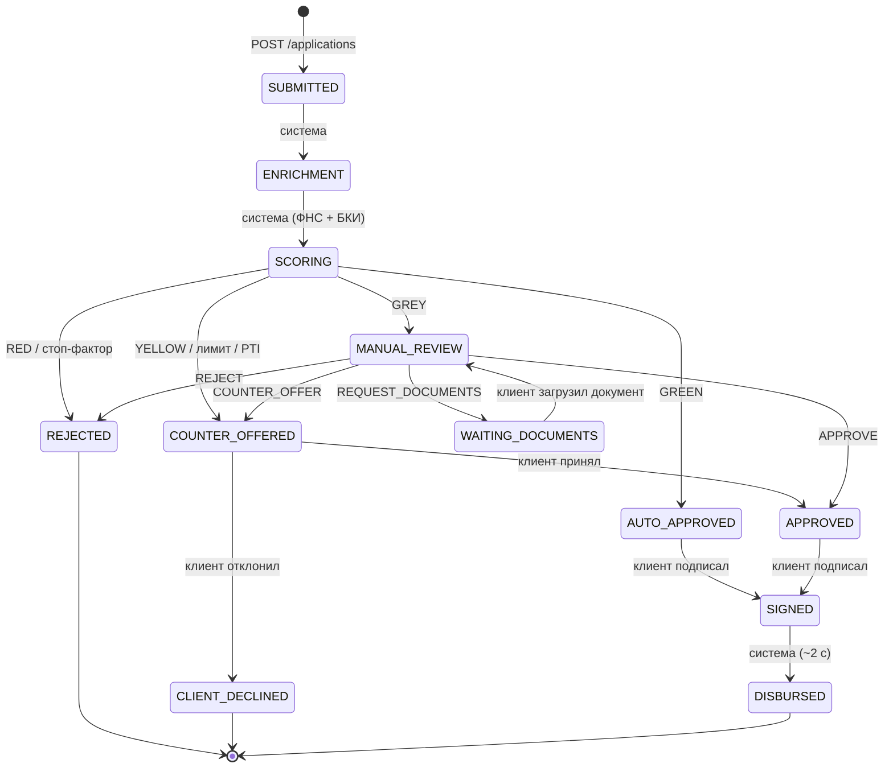

# Диаграмма состояний заявки

```mermaid
stateDiagram-v2
    [*] --> SUBMITTED: POST /applications
    SUBMITTED --> ENRICHMENT: система
    ENRICHMENT --> SCORING: система (ФНС + БКИ)
    SCORING --> AUTO_APPROVED: GREEN
    SCORING --> COUNTER_OFFERED: YELLOW / лимит / PTI
    SCORING --> MANUAL_REVIEW: GREY
    SCORING --> REJECTED: RED / стоп-фактор

    COUNTER_OFFERED --> APPROVED: клиент принял
    COUNTER_OFFERED --> CLIENT_DECLINED: клиент отклонил

    MANUAL_REVIEW --> WAITING_DOCUMENTS: REQUEST_DOCUMENTS
    WAITING_DOCUMENTS --> MANUAL_REVIEW: клиент загрузил документ
    MANUAL_REVIEW --> APPROVED: APPROVE
    MANUAL_REVIEW --> COUNTER_OFFERED: COUNTER_OFFER
    MANUAL_REVIEW --> REJECTED: REJECT

    AUTO_APPROVED --> SIGNED: клиент подписал
    APPROVED --> SIGNED: клиент подписал
    SIGNED --> DISBURSED: система (~2 с)

    REJECTED --> [*]
    CLIENT_DECLINED --> [*]
    DISBURSED --> [*]
```

Любой переход вне этой схемы: HTTP 409, `code = CONFLICT_STATE`, запись в audit log не создаётся.
